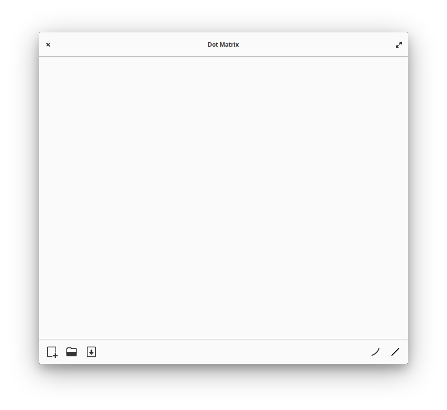

# Dot Matrix

The glyph playground of creativity from simple lines

###

[](https://stopthemingmy.app)
[](http://www.gnu.org/licenses/gpl-3.0)



<p align="center"><a href='https://flathub.org/apps/details/io.github.lainsce.DotMatrix'></a></p>

## 💝 Donations

Would you like to support the development of this app to new heights? Then:

[Be my backer on Ko-Fi](https://www.ko-fi.com/lainsce)

## 🛠️ Dependencies

Please make sure you have these dependencies first before building.

```bash
gtk4
libadwaita-1
libgee-0.8
meson
vala
```

## 🏗️ Building

Simply clone this repo, then:

```bash
meson _build --prefix=/usr && cd _build
sudo ninja install
```
