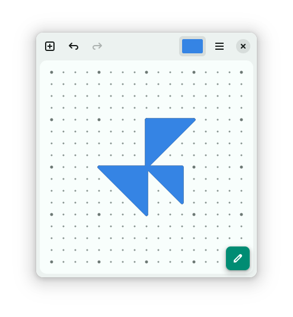

#  Dot Matrix

## The glyph playground of creativity from simple lines

[](https://appcenter.elementary.io/com.github.lainsce.dot-matrix)

[](https://travis-ci.org/lainsce/dot-matrix)
[](http://www.gnu.org/licenses/gpl-3.0)



## Donations

Would you like to support the development of this app to new heights? Then:

[Be my backer on Patreon](https://www.patreon.com/lainsce)

## Dependencies

Please make sure you have these dependencies first before building.

```bash
granite
gtk+-3.0
meson
libgoocanvas-2.0-dev
```

## Building

Simply clone this repo, then:

```bash
meson build --prefix=/usr && cd build
sudo ninja install
```
